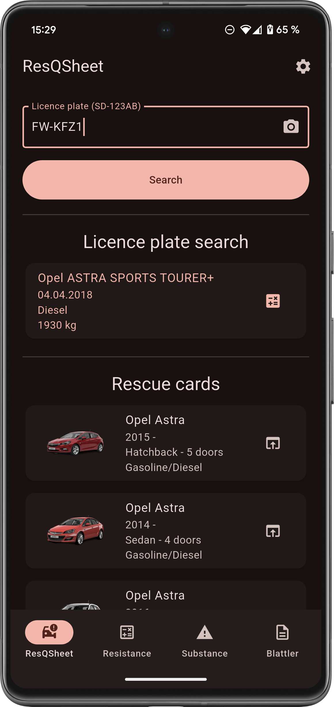
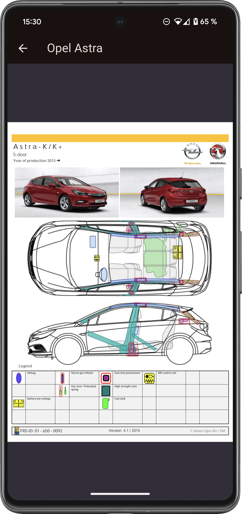
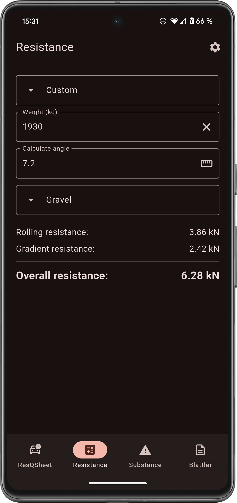
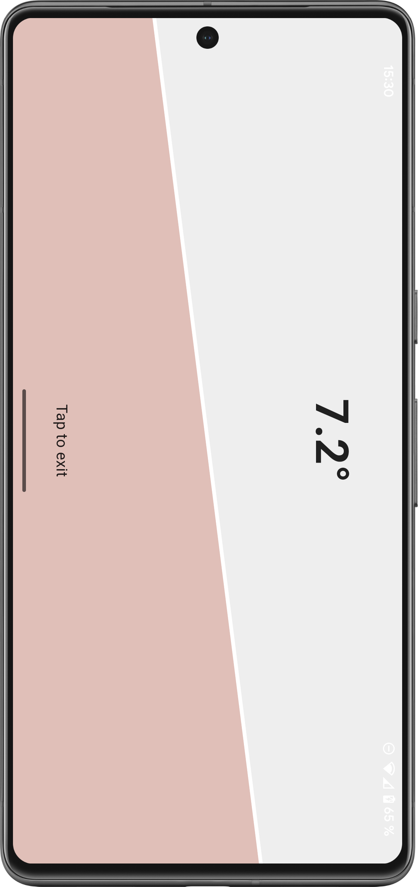
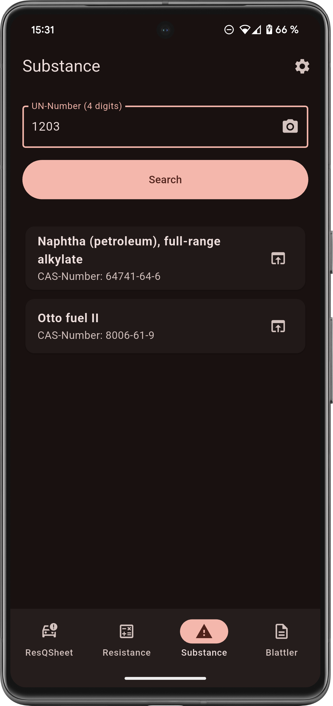
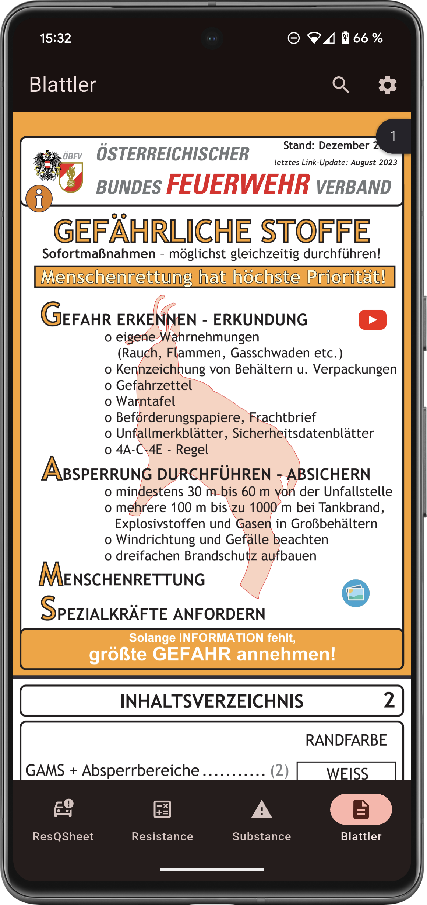

# ResQTools

**ResQTools** is a **Flutter** application developed for **Android** and **iOS**, offering essential digital tools to support **firefighting** and vehicle rescue operations.

## Key Features

### Automatic Rescue Sheet Retrieval

- Instantly retrieves the **official rescue sheet** for vehicles via [Euro NCAP Rescue Sheets](https://rescue.euroncap.com), based on the **Austrian license plate** through [FeuerwehrApp](https://www.feuerwehrapp.at).
- License Plate Recognition (OCR) powered by Google ML Kit ensures high accuracy.

### Force Calculation

- Calculates the **required towing force** by factoring in:
    - **Rolling resistance**
    - **Slope resistance**

#### Forces Table – OÖLFV

For detailed calculations related to required forces, refer to the **Forces Table** provided by the **Upper Austrian Fire Brigade Association (OÖLFV)**:

📄 [View Forces Table](docs/forces-table-ooelfv.pdf)

### Hazardous Substance Identification

- Identifies dangerous goods using the substance number found on orange plates.
- Data sourced from the [GESTIS Substance Database](https://www.dguv.de/ifa/gestis/gestis-stoffdatenbank/index.jsp).
- OCR-based substance number recognition via Google ML Kit.

### Blattler Integration

- Built-in PDF viewer for the **Blattler**, a crucial operational aid for firefighters.

## Screenshots

  
   
  
  
  
  

